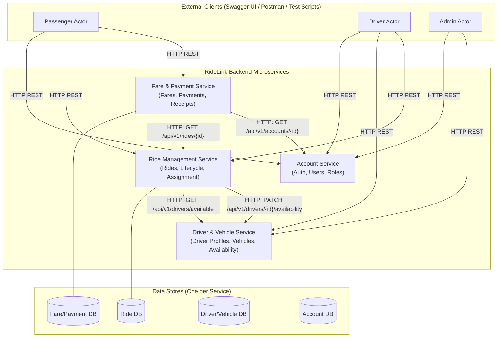
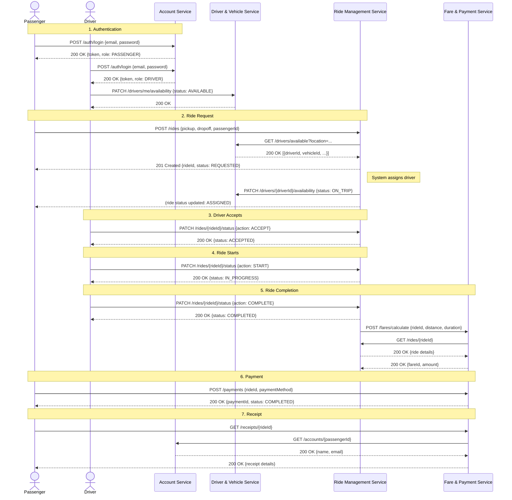

# 02 – Architecture

**Document type:** Architectural design  
**Source of truth for:** System architecture, service decomposition, communication style, and architectural patterns  
**Status:** Draft – Pending team review

---

## 1. Architecture Style

RideLink adopts a **microservices architecture**.

The system is decomposed into four independently deployable, independently maintainable backend services. Each service:

- Has a single, well-defined business responsibility.
- Owns its own data store exclusively.
- Communicates with other services only through defined APIs.
- Can be built, tested, and run independently.

This architecture style was selected because:

1. The assignment explicitly requires four independent backend services.
2. It allows four group members to develop and own one service each with minimal coupling.
3. It demonstrates the microservices concepts required by the module.

---

## 2. Microservices vs Monolith Comparison

| Dimension | Monolith | Microservices (RideLink) |
|---|---|---|
| Codebase | Single shared codebase | Four independent codebases |
| Deployment | One deployable unit | Four independently deployable units |
| Data | Shared database | Each service owns its own database |
| Development | All developers work in one repo area | Each developer owns one service independently |
| Fault isolation | A bug can affect the whole system | A bug in one service does not necessarily crash others |
| Complexity | Lower infrastructure complexity | Higher infrastructure complexity (managed by keeping optional infrastructure minimal) |
| Testability | Test the whole app together | Each service testable in isolation |
| Assignment fit | Does not meet assignment requirements | Meets assignment requirements directly |

---

## 3. Four-Service Architecture

### Services and Responsibilities

| Service | Core Responsibility | Primary Group Member |
|---|---|---|
| **Account Service** | User identity, authentication, roles, profile management | **[RESOLVED]** Member 1 |
| **Driver & Vehicle Service** | Driver profiles, vehicle registration, driver availability | **[RESOLVED]** Member 2 |
| **Ride Management Service** | Ride lifecycle, status transitions, driver assignment | **[RESOLVED]** Member 3 |
| **Fare & Payment Service** | Fare estimation, payment simulation, receipt management | **[RESOLVED]** Member 4 |

### Service Dependencies (Logical)

| Service | Depends On (for data it needs) | Nature of Dependency |
|---|---|---|
| Ride Management Service | Account Service | Validates passenger identity |
| Ride Management Service | Driver & Vehicle Service | Queries driver availability, assigns driver |
| Fare & Payment Service | Ride Management Service | Reads ride details to calculate fare |
| Fare & Payment Service | Account Service | Reads passenger/driver information for receipt |

> **Important:** Dependencies are **logical API dependencies only**, never direct database dependencies.

---

## 4. Data Ownership Principle

Each service owns its own database and its own data. This is a hard architectural rule.

- **Account Service** owns: users, credentials, roles, account status.
- **Driver & Vehicle Service** owns: driver profiles, vehicles, driver availability.
- **Ride Management Service** owns: rides, ride status history.
- **Fare & Payment Service** owns: fares, payment records, receipts.

A service only stores **foreign identifiers** (IDs) that reference entities owned by another service. It never stores a copy of another service's full data model.

See `05-data-ownership.md` for details.

---

## 5. Interservice Communication Principle

- The **primary** communication method between services is **synchronous HTTP REST** calls (service-to-service API calls).
- This is the simplest approach that satisfies the assignment requirements.
- Asynchronous messaging (message brokers) is **not introduced** unless the team identifies a clear assignment-justified need.

See `07-communication-and-security.md` for details.

---

## 6. Authentication and Security Boundary

- The **Account Service** is the authentication authority.
- It issues tokens (approach **[RESOLVED]** – JWT, see OS-01 in `07-communication-and-security.md`) on successful login.
- All other services validate tokens on incoming requests.
- Role-based authorization is enforced within each service based on the role embedded in the token.
- No service stores passwords. Only the Account Service handles credential verification.

See `07-communication-and-security.md` for details.

---

## 7. External Interface

- All services expose **RESTful JSON APIs** under the `/api/v1/` base path.
- Each service has its own **Swagger/OpenAPI** documentation available at its own base URL.
- The **machine-readable API contracts** are in [`contracts/`](../../contracts/) — these are the authoritative source for all endpoint definitions.
- A **shared Postman collection** is the primary testing and demonstration tool.
- There is no browser frontend.
- All external actors (Swagger UI, Postman, test scripts) communicate directly with individual service APIs.

See [`contracts/README.md`](../../contracts/README.md) for the contract file index.

---

## 8. High-Level Architecture Diagram

---

## 9. Sequence Diagram – Full Ride Lifecycle

This diagram shows the primary end-to-end happy path, illustrating the key interservice interactions.

---

## 10. Interservice Interactions (Minimum Required)

The assignment requires at least two meaningful interservice interactions. The following are confirmed:

| # | From Service | To Service | Trigger | Endpoint Called | Purpose |
|---|---|---|---|---|---|
| ISI-01 | Ride Management Service | Driver & Vehicle Service | Passenger requests a ride | `GET /api/v1/drivers/available` | Find an available driver to assign |
| ISI-02 | Ride Management Service | Driver & Vehicle Service | Driver assigned to ride | `PATCH /api/v1/drivers/{id}/availability` | Update driver status to ON_TRIP |
| ISI-03 | Fare & Payment Service | Ride Management Service | Fare calculation triggered | `GET /api/v1/rides/{rideId}` | Read ride details (distance, duration) |
| ISI-04 | Fare & Payment Service | Account Service | Receipt generated | `GET /api/v1/accounts/{id}` | Enrich receipt with passenger/driver name |

> ISI-01 and ISI-02 together satisfy the two-interaction requirement. ISI-03 and ISI-04 are strongly recommended and add value without adding unnecessary complexity.

---

## 11. Architectural Advantages

1. **Assignment alignment** – Architecture directly maps to the four-service assignment requirement.
2. **Independent development** – Each developer works on one service without blocking others.
3. **Independent testability** – Each service can be unit-tested and API-tested independently.
4. **Clear ownership** – Service boundaries prevent confusion about who is responsible for which logic.
5. **Demonstrates concepts** – Shows microservices decomposition, data isolation, and interservice communication.

---

## 12. Architectural Limitations

1. **Local coordination overhead** – Running four services locally requires starting four processes.
2. **Interservice call latency** – Synchronous HTTP calls between services add latency (acceptable for the assignment).
3. **Distributed data consistency** – No distributed transactions are used; eventual consistency is accepted for assignment scope.
4. **Debugging complexity** – Tracing a request across multiple services is harder than in a monolith (mitigated by Postman and Swagger).

---

## 13. Architectural Risks

| Risk | Likelihood | Impact | Mitigation |
|---|---|---|---|
| Service boundary violation (cross-DB access) | Medium | High | Enforce rule via code review and these documents |
| Scope creep (adding a 5th service) | Low | Medium | Strictly follow `01-system-overview.md` scope |
| API contract drift (services don't agree) | Medium | High | All contract changes update `contracts/*.yaml` first; reviewed as a team |
| Interservice call failures not handled | Medium | High | Define fallback and error handling in `07-communication-and-security.md` |
| One service blocking another (synchronous) | Low | Medium | Design simple calls; avoid long chains |

---

## 14. Open Architectural Decisions

| ID | Decision Required | Options | Impact |
|---|---|---|---|
| OA-01 | **[RESOLVED]** Token validation strategy for non-Account services (Shared secret + local validation) | Shared secret + local validation vs. call Account Service to validate | Affects auth latency and coupling |
| OA-02 | [TEAM DECISION REQUIRED] Whether to use an API Gateway | Yes (single entry point) or No (clients call services directly) | Affects external interface simplicity |
| OA-03 | [TEAM DECISION REQUIRED] Whether to containerize with Docker | Yes or No – only if it provides clear CI/deployment benefit | Affects dev environment setup |
| OA-04 | **[RESOLVED]** Member-to-service assignment | Which member owns which service | Affects team workflow |
