# 06 – Business Workflows

**Document type:** Business workflow and state machine definition  
**Source of truth for:** End-to-end business flows, ride state machine, and interaction sequences  
**Status:** Draft – Pending team review

---

## Ride State Machine

This is the definitive definition of the ride lifecycle. All services must respect these transitions.

### Valid States

| State | Meaning |
|---|---|
| `REQUESTED` | Passenger has submitted a ride request; system is attempting to assign a driver |
| `ASSIGNED` | System has assigned an available driver; driver has not yet responded |
| `ACCEPTED` | Assigned driver has accepted the ride |
| `IN_PROGRESS` | Driver has started the ride; passenger is in the vehicle |
| `COMPLETED` | Driver has marked the ride as complete |
| `CANCELLED` | Ride was cancelled by passenger, driver, or system |

### Valid Transitions

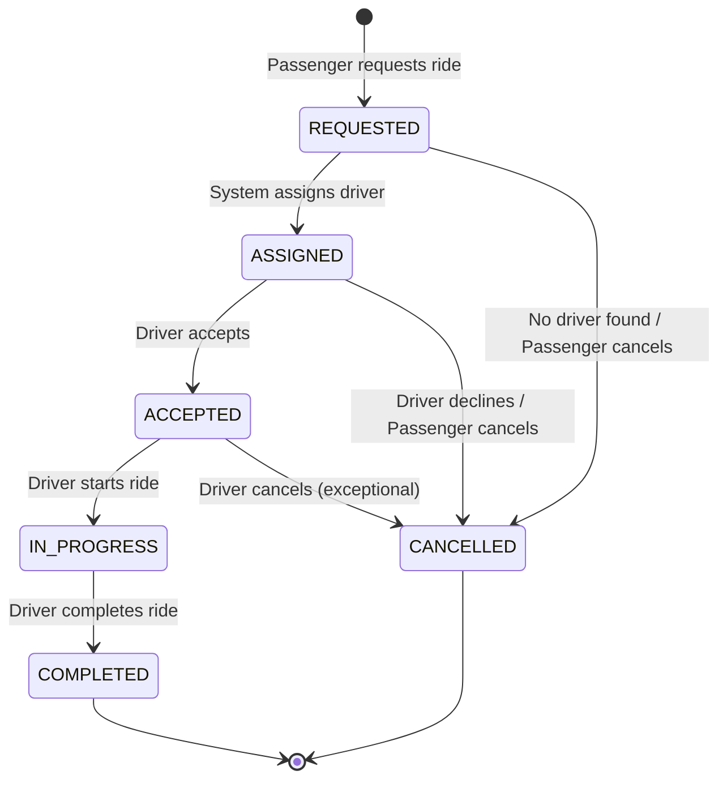

### Transition Rules Table

| From | To | Triggered By | Conditions |
|---|---|---|---|
| *(new)* | `REQUESTED` | PASSENGER via POST /rides | Valid passenger, valid pickup/dropoff |
| `REQUESTED` | `ASSIGNED` | System (RMS) | Available driver found |
| `REQUESTED` | `CANCELLED` | System or PASSENGER | No driver found, or passenger cancels |
| `ASSIGNED` | `ACCEPTED` | DRIVER | Only the assigned driver |
| `ASSIGNED` | `CANCELLED` | PASSENGER or DRIVER | Passenger withdraws, or driver declines |
| `ACCEPTED` | `IN_PROGRESS` | DRIVER | Only the assigned driver |
| `ACCEPTED` | `CANCELLED` | DRIVER | Exceptional case – driver cancels before pickup |
| `IN_PROGRESS` | `COMPLETED` | DRIVER | Only the assigned driver |

### Invalid Transitions (Negative Scenarios)

Any transition not listed above is **invalid** and must return a `409 INVALID_STATUS_TRANSITION` error.

Examples of invalid transitions to test:
- `ASSIGNED → IN_PROGRESS` (skipped ACCEPTED)
- `COMPLETED → CANCELLED`
- `IN_PROGRESS → ACCEPTED`
- `CANCELLED → any state`
- `COMPLETED → any state`

---

## Workflow 1 – Account Registration and Login

**Actor:** New user (Passenger or Driver)  
**Services involved:** Account Service

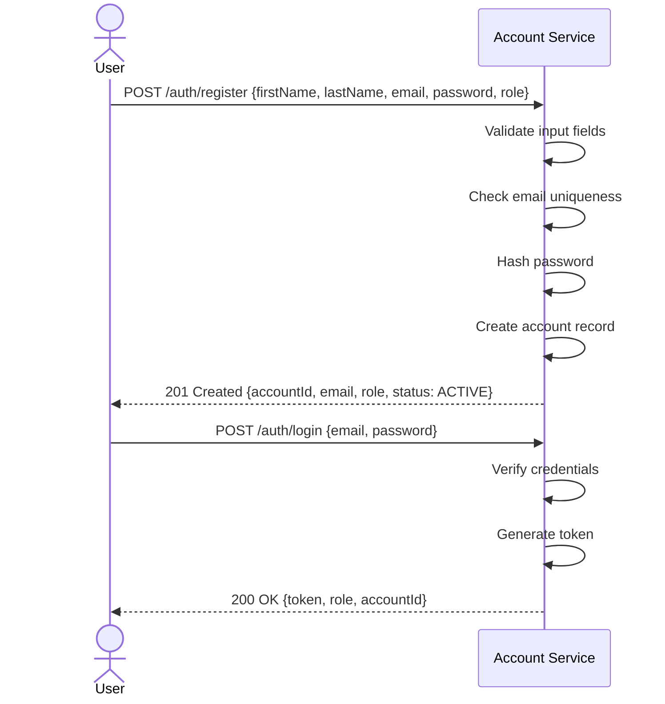

**Failure scenarios:**
- Email already registered → `409 Conflict`
- Wrong password → `401 Unauthorized`
- Account suspended → `403 Forbidden`

---

## Workflow 2 – Driver Registration and Preparation

**Actor:** Driver (already has an account with role=DRIVER)  
**Services involved:** Account Service, Driver & Vehicle Service

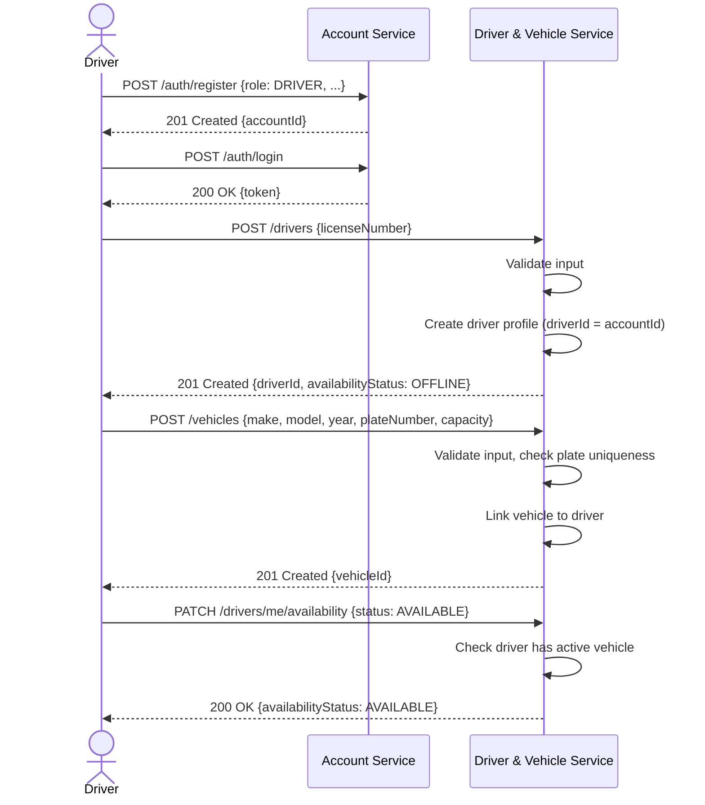

**Failure scenarios:**
- Driver profile already exists → `409 Conflict`
- No active vehicle when going AVAILABLE → `403 Forbidden`
- Plate number already registered → `409 Conflict`

---

## Workflow 3 – Fare Estimation

**Actor:** Passenger  
**Services involved:** Fare & Payment Service

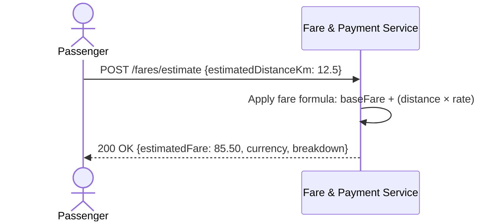

> This workflow has no interservice calls. Fare estimation uses only the Fare & Payment Service's own configured fare rules.

---

## Workflow 4 – Ride Request and Driver Assignment

**Actor:** Passenger  
**Services involved:** Ride Management Service, Driver & Vehicle Service

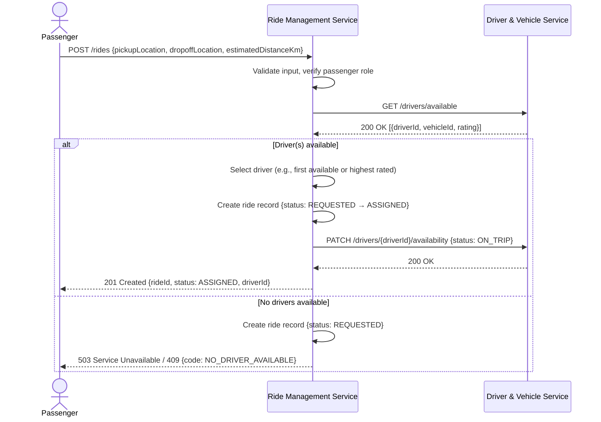

**Interservice interaction:** RMS → DVS (ISI-01 and ISI-02)

---

## Workflow 5 – Ride Acceptance

**Actor:** Driver  
**Services involved:** Ride Management Service

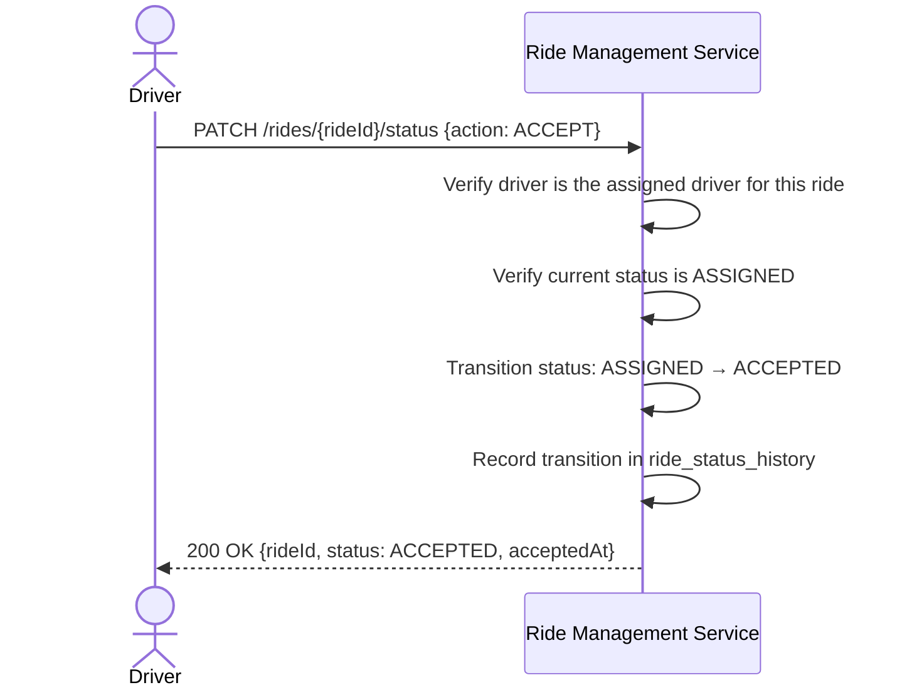

**Failure scenarios:**
- Wrong driver tries to accept → `403 Forbidden`
- Ride is not in ASSIGNED state → `409 Invalid transition`

---

## Workflow 6 – Ride Start

**Actor:** Driver  
**Services involved:** Ride Management Service

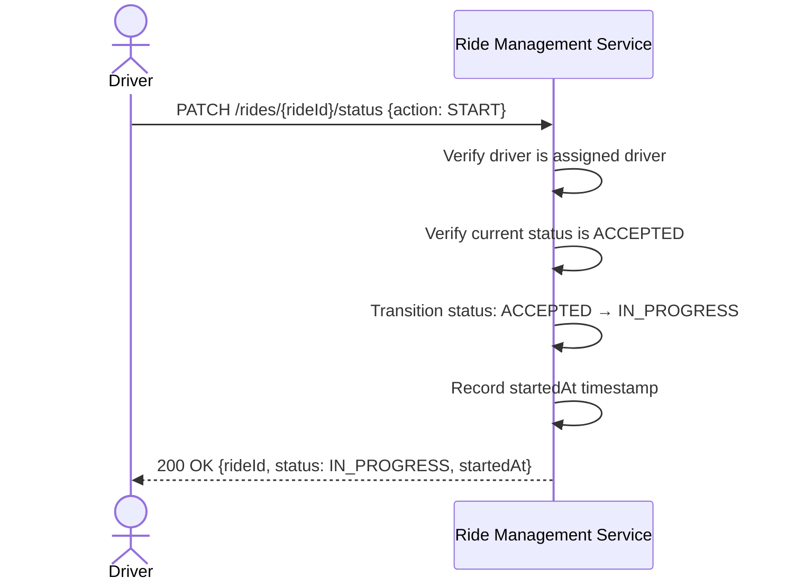

---

## Workflow 7 – Ride Completion

**Actor:** Driver  
**Services involved:** Ride Management Service, Driver & Vehicle Service, Fare & Payment Service

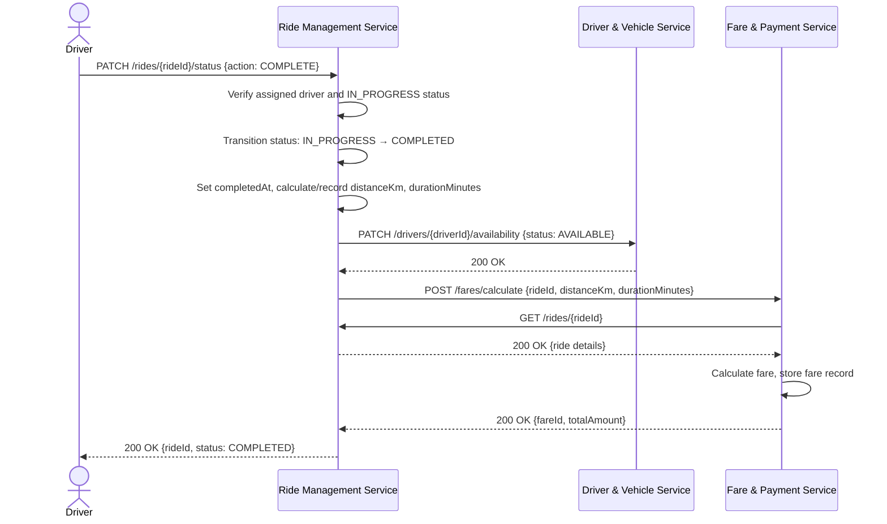

> **[RESOLVED]** – The trigger mechanism for fare calculation is a synchronous call from RMS to FPS (see OB-02 in `03-service-boundaries.md`).

---

## Workflow 8 – Final Fare and Simulated Payment

**Actor:** Passenger  
**Services involved:** Fare & Payment Service

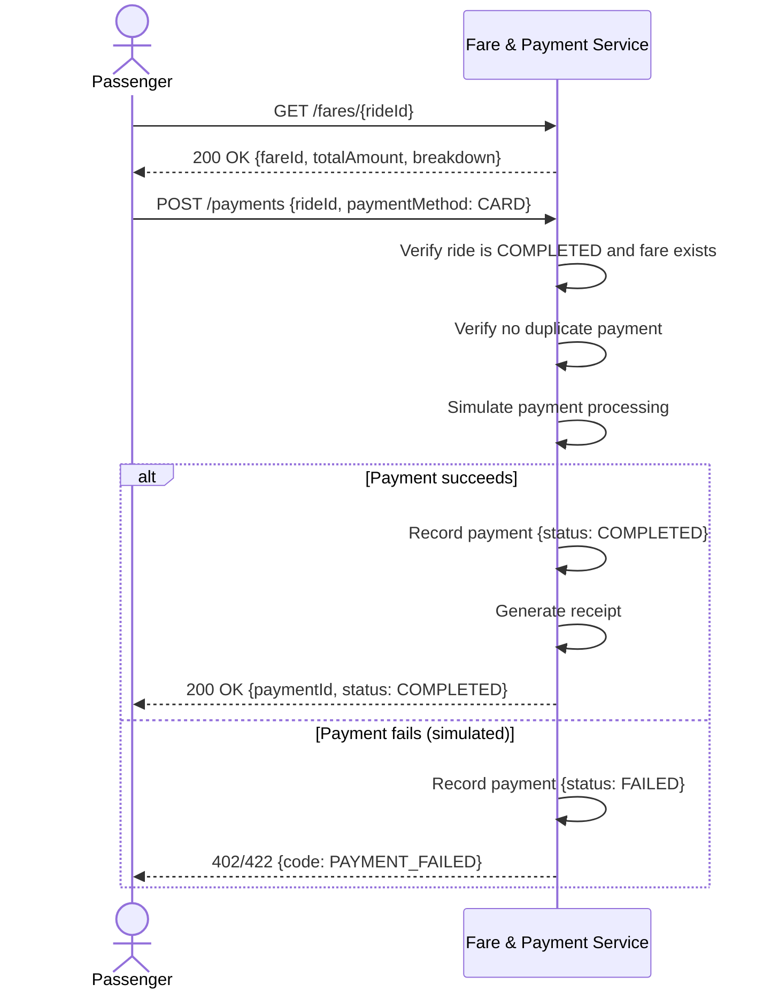

---

## Workflow 9 – Receipt Retrieval

**Actor:** Passenger or Driver  
**Services involved:** Fare & Payment Service, Account Service

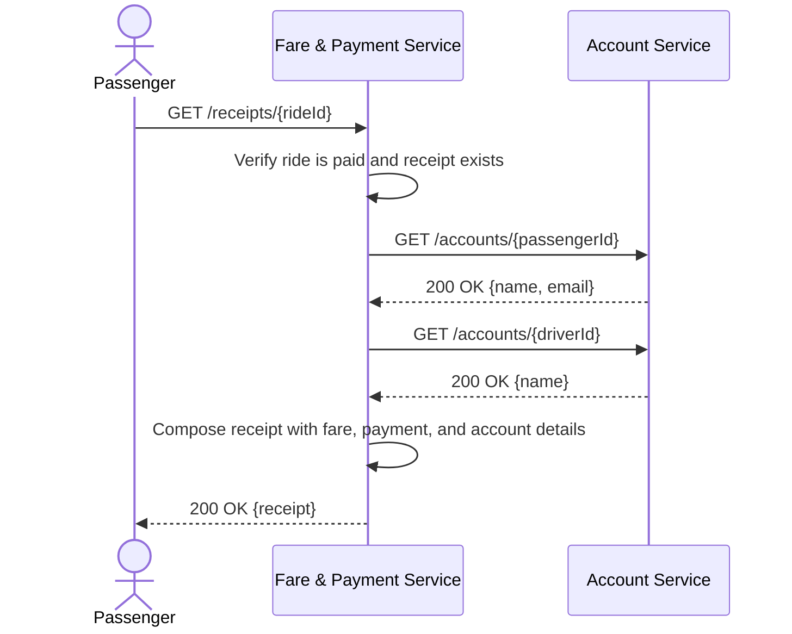

> If the receipt was previously generated and a name snapshot was stored, the second pair of Account Service calls may be skipped.

---

## Workflow 10 – Cancellation

**Sub-workflow A: Passenger cancels while REQUESTED or ASSIGNED**

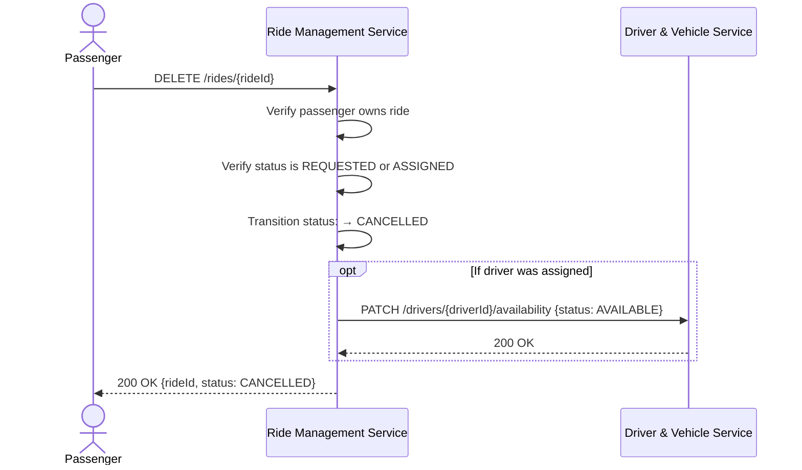

**Sub-workflow B: Passenger tries to cancel a COMPLETED ride (negative scenario)**

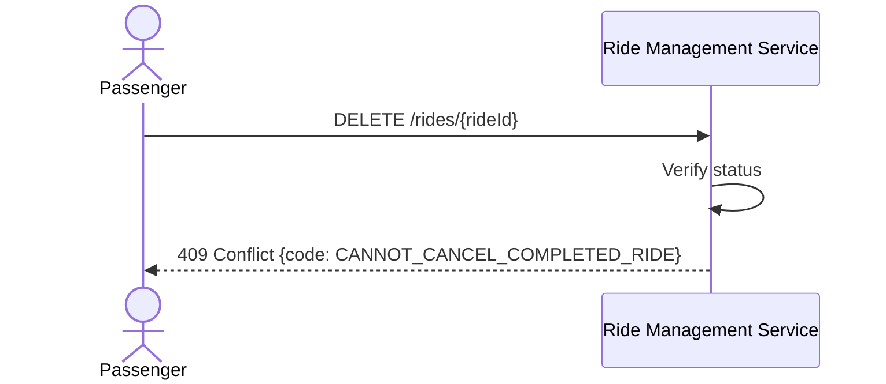

---

## Workflow 11 – Negative Scenarios (Required Demonstrations)

The team must select at least two of the following to formally demonstrate.

### N-01: No Available Driver

```
POST /rides
↓
RMS calls GET /drivers/available
↓
DVS returns [] (empty list)
↓
RMS returns 503 / 409 {code: NO_DRIVER_AVAILABLE}
```

### N-02: Invalid Ride Status Transition

```
PATCH /rides/{rideId}/status {action: COMPLETE}
(when ride is still in ASSIGNED state)
↓
RMS checks: ASSIGNED → COMPLETED is not a valid transition
↓
RMS returns 409 {code: INVALID_STATUS_TRANSITION}
```

### N-03: Unauthorized Access

```
GET /rides/{rideId}
(with no token, or a passenger trying to view another passenger's ride)
↓
Returns 401 or 403
```

### N-04: Invalid Input

```
POST /auth/register {email: "not-an-email", password: "1"}
↓
Account Service validates input
↓
Returns 400 {error: {code: VALIDATION_ERROR, details: [...]}}
```

### N-05: Simulated Payment Failure

```
POST /payments {rideId, paymentMethod: CARD}
↓
Fare & Payment Service simulates processing
↓
Returns 402 / 422 {code: PAYMENT_FAILED}
```

### N-06: Duplicate Registration

```
POST /auth/register {email: "existing@email.com", ...}
↓
Account Service checks uniqueness
↓
Returns 409 {code: EMAIL_ALREADY_REGISTERED}
```

---

## Fare Calculation Formula

The fare calculation uses a fixed, configurable formula. This is a **team design decision** (not an assignment requirement), but must be consistent across all services that reference fares.

```
totalFare = baseFare + (distanceKm × ratePerKm)
```

| Parameter | Description | Example Value |
|---|---|---|
| `baseFare` | Fixed minimum charge per ride | 300.00 |
| `ratePerKm` | Charge per kilometre | 100.00 |
| `surcharge` | Optional peak-hour or other charge | 0.00 (default) |

> Example: 12.5 km ride = 300.00 + (12.5 × 100.00) = 300.00 + 1250.00 = **1550.00 LKR**

Exact values are **[RESOLVED]** (baseFare: 300.00, ratePerKm: 100.00, Currency: LKR) and should be stored as configuration, not hardcoded.

---

## Open Workflow Decisions

| ID | Decision Required |
|---|---|
| OW-01 | **[RESOLVED]** Driver selection algorithm: FIRST AVAILABLE DRIVER |
| OW-02 | **[RESOLVED]** When an assigned driver declines: Ride becomes CANCELLED (no reassignment) |
| OW-03 | **[RESOLVED]** Driver rating update is NOT part of Phase 1 implementation |
| OW-04 | **[RESOLVED]** Fare calculation is synchronous from RMS |
| OW-05 | **[RESOLVED]** Fare formula parameter values (baseFare: 300.00, ratePerKm: 100.00, LKR) |
| OW-06 | **[RESOLVED]** Negative scenarios: N-02 (Invalid ride status transition), N-05 (Simulated payment failure) |
