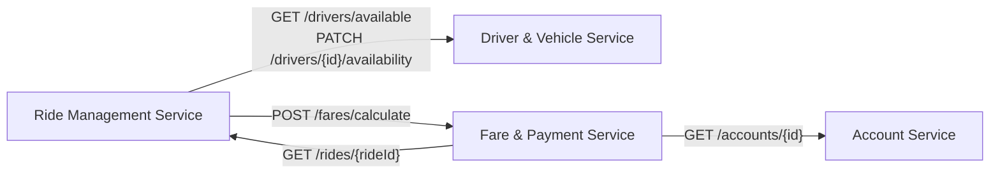

# 07 – Communication and Security

**Document type:** Cross-cutting concerns definition  
**Source of truth for:** Interservice communication, authentication, authorization, roles, validation, and security  
**Status:** Draft – Pending team review

---

## 1. Interservice Communication Strategy

### Primary Communication Method

**Synchronous HTTP REST** (service-to-service JSON API calls over HTTP).

This is the chosen method because:
1. It is the **simplest** approach that satisfies the assignment requirements.
2. All services already expose RESTful APIs – reusing the same protocol for internal calls avoids introducing a second communication technology.
3. Interservice interactions in RideLink are request-response in nature (e.g., "give me available drivers", "update driver availability") – synchronous REST fits this model naturally.
4. The assignment does not present a use case that justifies asynchronous messaging (no fire-and-forget, no fan-out, no long-running background processing).

### Communication Style Decision Table

| Style | Description | Used in RideLink | Reason |
|---|---|---|---|
| Synchronous HTTP REST | Service calls another service's API and waits for response | ✅ Yes | Simple, sufficient for the assignment |
| Asynchronous messaging (e.g., RabbitMQ, Kafka) | Service publishes an event; another service consumes it independently | ❌ Not used (unless team decides otherwise) | Adds infrastructure complexity; no current use case requires it |
| gRPC | Binary, typed protocol for interservice calls | ❌ Not used | More complex; no performance requirement justifies it |
| Shared database | Services query each other's DB directly | ❌ Strictly prohibited | Violates data ownership principle |

---

## 2. Which Services Communicate and Why

| Caller | Callee | Endpoint Called | Why | When |
|---|---|---|---|---|
| Ride Management Service | Driver & Vehicle Service | `GET /drivers/available` | Need to find an available driver to assign | Ride request received |
| Ride Management Service | Driver & Vehicle Service | `PATCH /drivers/{id}/availability` | Set driver to ON_TRIP after assignment | Ride assigned |
| Ride Management Service | Driver & Vehicle Service | `PATCH /drivers/{id}/availability` | Set driver back to AVAILABLE | Ride completed or cancelled |
| Ride Management Service | Fare & Payment Service | `POST /fares/calculate` | Trigger fare calculation on ride completion | Ride completed |
| Fare & Payment Service | Ride Management Service | `GET /rides/{rideId}` | Read ride details for fare calculation | Fare calculation |
| Fare & Payment Service | Account Service | `GET /accounts/{id}` | Read passenger/driver name for receipt | Receipt generation |

### Service Communication Diagram



---

## 3. Comparison of Communication Approaches

### Synchronous REST (Selected)

| Aspect | Detail |
|---|---|
| **Simplicity** | High – uses the same HTTP/JSON stack already in place |
| **Coupling** | Services are coupled at call-time (caller must be up when callee is called) |
| **Latency** | Adds HTTP round-trip latency for each interservice call |
| **Failure handling** | Caller must handle 4xx/5xx responses and timeouts |
| **Observability** | Easy to trace in logs and Postman |
| **Assignment suitability** | Excellent – simple, demonstrable, and directly testable in Postman |

### Asynchronous Messaging (Not Selected)

| Aspect | Detail |
|---|---|
| **Simplicity** | Low – requires a message broker (RabbitMQ, Kafka, etc.) |
| **Coupling** | Services are decoupled temporally (producer doesn't wait for consumer) |
| **Latency** | Lower perceived latency for the caller |
| **Failure handling** | Dead-letter queues, retries, idempotency required |
| **Observability** | Harder to trace end-to-end |
| **Assignment suitability** | Over-engineered for the assignment unless there's a specific need |

> **Decision:** Synchronous REST is selected as the primary mechanism. The team may reconsider if a specific use case emerges that genuinely benefits from async messaging.

---

## 4. Interservice Error Handling

When Service A calls Service B and Service B is unavailable or returns an error, Service A must:

1. **Do not let the error propagate silently** – log the error.
2. **Return a meaningful error response** to the original caller.
3. **Use appropriate HTTP status codes:**
   - If the downstream service returns `4xx`, treat it as a business logic error.
   - If the downstream service returns `5xx` or times out, return `503 Service Unavailable` with a message explaining that a downstream dependency is unavailable.

### Error Handling Table

| Scenario | Downstream Response | Upstream Returns |
|---|---|---|
| DVS unavailable when assigning driver | Connection timeout / 5xx | 503 – Cannot process ride request at this time |
| DVS returns empty list of available drivers | 200 with empty array | 503 or 409 – No drivers available |
| RMS unavailable when FPS fetches ride | Connection timeout / 5xx | 503 – Cannot calculate fare at this time |
| AS unavailable when FPS builds receipt | Connection timeout / 5xx | 503 – Cannot generate receipt at this time |

---

## 5. Authentication

### Approach

Token-based authentication. The Account Service issues a token on successful login. All other services validate the token on incoming requests.

**Token type:** **[RESOLVED]** – The team has decided to use:

| Option | Description | Pros | Cons |
|---|---|---|---|
| **JWT (JSON Web Token)** | Self-contained, signed token containing claims (accountId, role, expiry) | Stateless – services can validate without calling Account Service | Token cannot be revoked until expiry (unless a blacklist is used) |
| **Opaque token (session token)** | Random token; services must call Account Service to validate | Can be revoked instantly | Every protected request requires a call to Account Service |

> **Recommendation (team decision):** JWT is the most common choice for microservices because it enables stateless validation. The team should use a well-supported JWT library for the chosen language/framework.

### Token Contents (if JWT)

The JWT payload (claims) should include:

| Claim | Description |
|---|---|
| `sub` | The `accountId` of the authenticated user |
| `role` | The user's role (`PASSENGER`, `DRIVER`, `ADMIN`) |
| `email` | Optional – for display purposes |
| `iat` | Issued at (Unix timestamp) |
| `exp` | Expiry time (Unix timestamp) |

### Token Validation

Each service must validate:
1. Token is present in the `Authorization: Bearer <token>` header.
2. Token signature is valid (using the shared secret or public key).
3. Token has not expired.
4. The role embedded in the token satisfies the endpoint's role requirement.

**How other services access the signing secret:** **[RESOLVED]** – A shared secret (`JWT_SECRET`) stored as an environment variable in all services. The signing algorithm is HS256. (e.g., `JWT_SECRET=change-me-in-local-environment`)

---

## 6. Authorization

### Roles

| Role | Description | Can Access |
|---|---|---|
| `PASSENGER` | Registered user requesting rides | Own account, fare estimates, own rides, payment, receipts |
| `DRIVER` | Registered user accepting and completing rides | Own account, own driver profile, own vehicles, assigned rides |
| `ADMIN` | System administrator | All accounts, all drivers, all rides, all fares (read-only or with management capabilities) |

### Authorization Rules by Service

#### Account Service

| Endpoint | PASSENGER | DRIVER | ADMIN |
|---|---|---|---|
| POST /auth/register | ✅ | ✅ | ✅ |
| POST /auth/login | ✅ | ✅ | ✅ |
| GET /accounts/me | ✅ | ✅ | ✅ |
| PATCH /accounts/me | ✅ | ✅ | ✅ |
| GET /accounts/{id} | ❌ | ❌ | ✅ (+ internal) |
| GET /accounts | ❌ | ❌ | ✅ |
| PATCH /accounts/{id}/status | ❌ | ❌ | ✅ |

#### Driver & Vehicle Service

| Endpoint | PASSENGER | DRIVER | ADMIN |
|---|---|---|---|
| POST /drivers | ❌ | ✅ | ✅ |
| GET /drivers/me | ❌ | ✅ | ✅ |
| PATCH /drivers/me/availability | ❌ | ✅ | ✅ |
| GET /drivers/available | ❌ | ❌ | ✅ (+ internal) |
| PATCH /drivers/{id}/availability | ❌ | ❌ | ✅ (+ internal) |
| GET /drivers | ❌ | ❌ | ✅ |
| POST /vehicles | ❌ | ✅ | ✅ |
| GET /vehicles/me | ❌ | ✅ | ✅ |

#### Ride Management Service

| Endpoint | PASSENGER | DRIVER | ADMIN |
|---|---|---|---|
| POST /rides | ✅ | ❌ | ❌ |
| GET /rides/{id} | ✅ (own) | ✅ (assigned) | ✅ |
| GET /rides | ✅ (own) | ✅ (own) | ✅ (all) |
| PATCH /rides/{id}/status | ❌ (except CANCEL) | ✅ | ✅ |
| DELETE /rides/{id} | ✅ (own, valid status) | ✅ (own, valid status) | ✅ |

#### Fare & Payment Service

| Endpoint | PASSENGER | DRIVER | ADMIN |
|---|---|---|---|
| POST /fares/estimate | ✅ | ❌ | ✅ |
| POST /fares/calculate | ❌ | ❌ | ✅ (+ internal) |
| GET /fares/{rideId} | ✅ (own) | ✅ (assigned) | ✅ |
| POST /payments | ✅ (own) | ❌ | ❌ |
| GET /payments/{id} | ✅ (own) | ❌ | ✅ |
| GET /receipts/{rideId} | ✅ (own) | ✅ (assigned) | ✅ |

---

## 7. Internal Service Authentication

**[RESOLVED]** – RideLink uses TWO authentication contexts (OS-05):

1. **USER JWT**: Used for normal user-facing requests, representing `PASSENGER`, `DRIVER`, or `ADMIN`. External users present this token.
2. **SERVICE JWT**: Used for internal service-to-service operations when the original user's role is insufficient for the target endpoint.

### Service JWT Mechanism
- It identifies the calling service (e.g., `type = SERVICE`, `service = RIDE_SERVICE`).
- It is distinct from a user JWT and must not be treated as `PASSENGER` or `DRIVER`.
- The receiving service validates the Service JWT (signature, expiration, identity, type) and authorizes the explicitly documented internal endpoint.
- **Required identities**: `RIDE_SERVICE` and `FARE_PAYMENT_SERVICE`.
- **Required flows**:
  - `Ride Management Service` -> `FARE & PAYMENT SERVICE` (`POST /api/v1/fares/calculate`) uses `RIDE_SERVICE` identity.
  - `Fare & Payment Service` -> `RIDE MANAGEMENT SERVICE` (`GET /api/v1/rides/{rideId}`) uses `FARE_PAYMENT_SERVICE` identity.
- Service credentials and signing secrets MUST NOT be committed to Git. Environment-based configuration (e.g., `RIDE_SERVICE_JWT_SECRET`) must be used for signing and validation secrets.

---

## 8. Input Validation

All services must validate all incoming inputs. The following validation rules apply uniformly.

### Global Validation Rules

| Rule | Description |
|---|---|
| V-01 | Required fields must be present and non-null |
| V-02 | String fields must meet length constraints (see `04-api-contracts.md`) |
| V-03 | Email fields must match a standard email format |
| V-04 | Password fields must meet minimum complexity requirements |
| V-05 | Enum fields must contain only allowed values |
| V-06 | Numeric fields must be within defined ranges |
| V-07 | UUIDs (or IDs) must be in the correct format |
| V-08 | Dates must be in ISO 8601 format where applicable |

### Validation Error Response

All validation failures return `400 Bad Request` with a structured error body:

```json
{
  "success": false,
  "error": {
    "code": "VALIDATION_ERROR",
    "message": "One or more fields failed validation.",
    "details": [
      "email: must be a valid email address",
      "password: must be at least 8 characters"
    ]
  }
}
```

---

## 9. Secret and Configuration Management

**[RESOLVED]** – The team has decided to manage secrets and configurations via environment variables.

| Item | Description | Decision Required |
|---|---|---|
| JWT signing secret | Must be shared across all services that validate tokens | **[RESOLVED]** – `JWT_SECRET` environment variable |
| Database credentials | Each service has its own credentials | **[RESOLVED]** – environment variables |
| Service URLs | Each service must know the base URL of other services it calls | **[RESOLVED]** – environment variables (e.g., `ACCOUNT_SERVICE_URL`) |
| Fare formula parameters | baseFare, ratePerKm | **[RESOLVED]** – environment variables |

> **Recommendation:** Use **environment variables** for all secrets and configuration. Do NOT hardcode secrets, passwords, or signing keys in source code. Use a `.env` file locally and CI secrets for the pipeline.

---

## 10. Common Security Risks and Mitigations

| Risk | Description | Mitigation |
|---|---|---|
| Broken authentication | Weak password hashing, tokens that never expire | Use bcrypt/argon2 for passwords; set reasonable JWT expiry |
| Broken authorization | Wrong role can access protected resources | Enforce role checks on every protected endpoint |
| Cross-service data access | Service queries another service's DB | Architecture rule + code review enforcement |
| Mass assignment | Client sends extra fields that get saved | Use DTOs/request models; never bind directly to DB entities |
| Information exposure | Error messages reveal internal details | Return generic error messages; log details server-side |
| No input validation | Malformed input causes crashes or incorrect behavior | Validate all inputs at the controller/handler layer |
| Token leakage | JWT stored insecurely by client | Out of scope (no frontend); document for awareness |
| SQL injection | Malicious input manipulates database queries | Use parameterized queries or ORMs; never concatenate SQL |

---

## 11. Open Security and Communication Decisions

| ID | Decision Required |
|---|---|
| OS-01 | **[RESOLVED]** JWT vs. opaque token for authentication (JWT confirmed) |
| OS-02 | **[RESOLVED]** JWT signing algorithm (HS256) and secret management (`JWT_SECRET` env var) |
| OS-03 | [TEAM DECISION REQUIRED] Token expiry duration |
| OS-04 | **[RESOLVED]** Logout is stateless (no token blacklist) |
| OS-05 | **[RESOLVED]** Internal service call authentication mechanism (Service JWT with specific service identity) |
| OS-06 | **[RESOLVED]** How service base URLs are shared (Environment variables) |
| OS-07 | [TEAM DECISION REQUIRED] Password hashing library (bcrypt, argon2, etc.) |
| OS-08 | [TEAM DECISION REQUIRED] Whether HTTPS is required for local development or only for a deployed environment |
