# 08 – Development Plan

**Document type:** Implementation roadmap  
**Source of truth for:** Phase-by-phase implementation sequence and completion criteria  
**Status:** Draft – Pending team review

---

## Guiding Principle

> Build one working end-to-end workflow as early as possible.
>
> Don't spend excessive time on optional infrastructure before the core business logic works.

The recommended order below prioritizes getting a demonstrable ride lifecycle working before investing in full test coverage, Swagger refinement, and CI setup.

---

## Overview: Phase Dependency Map

```mermaid
graph LR
    P1[Phase 1: Requirements & Architecture] --> P2[Phase 2: Data Design]
    P2 --> P3[Phase 3: API Contracts]
    P3 --> P4[Phase 4: Repo Structure]
    P4 --> P5[Phase 5: Service Skeletons]
    P5 --> P6[Phase 6: Account Service]
    P5 --> P7[Phase 7: Driver & Vehicle Service]
    P5 --> P8[Phase 8: Ride Management Service]
    P5 --> P9[Phase 9: Fare & Payment Service]
    P6 --> P10[Phase 10: Interservice Communication]
    P7 --> P10
    P8 --> P10
    P9 --> P10
    P10 --> P11[Phase 11: End-to-End Integration]
    P11 --> P12[Phase 12: Auth/Authz]
    P12 --> P13[Phase 13: Validation/Error Handling]
    P13 --> P14[Phase 14: Unit Testing]
    P14 --> P15[Phase 15: Integration/Postman Testing]
    P15 --> P16[Phase 16: Swagger Completion]
    P16 --> P17[Phase 17: CI Pipeline]
    P17 --> P18[Phase 18: Documentation]
    P18 --> P19[Phase 19: Individual Review]
    P19 --> P20[Phase 20: Final Demo]
```

---

## Phase 1 – Requirements and Architecture

**Objective:** Establish the shared architectural foundation that all four developers will work from.

**Main tasks:**
- Review and approve all documents in `docs/reference/`.
- Resolve all `[DECISION REQUIRED]` items that block Phase 2–5 work (at minimum: language, framework, database technology).
- Assign each service to a group member.
- Set up the Git repository and agree on the branching strategy.
- Agree on commit message conventions.

**Expected output:**
- All `docs/reference/` documents reviewed and approved.
- Open decisions resolved for language, framework, DB, port assignments.
- Member-to-service assignment confirmed.
- Git repo created with `main`/`develop` branches (or chosen strategy).

**Dependencies:** None.

**Completion criteria:**
- ✅ Team has agreed on language/framework.
- ✅ Team has agreed on database technology.
- ✅ Each member knows which service they own.
- ✅ Git repository exists and all members can push to it.
- ✅ No blocking `[DECISION REQUIRED]` items remain for Phases 2–5.

---

## Phase 2 – Database / Data Ownership Design

**Objective:** Define the exact schema for each service's database before writing any application code.

**Main tasks:**
- Each service owner designs their service's database schema (tables/collections, fields, types, constraints).
- Schemas must be consistent with `05-data-ownership.md`.
- Agree on ID format (UUID vs. integer) across all services.
- Agree on naming conventions (snake_case, etc.).
- Document any schema decisions that affect cross-service IDs.

**Expected output:**
- A schema design document or ERD for each service (can be added to `docs/reference/05-data-ownership.md` or as separate files).
- No schema that violates the data isolation rule.

**Dependencies:** Phase 1 complete.

**Completion criteria:**
- ✅ Each service has a defined schema.
- ✅ All cross-service IDs are consistent.
- ✅ No shared tables exist.

---

## Phase 3 – API Contracts

**Objective:** Finalize all API contracts before implementation begins.

**Main tasks:**
- Review `04-api-contracts.md` as a team.
- Agree on any contract details that were marked `[DECISION REQUIRED]`.
- Resolve port assignments.
- Resolve ID format and pagination defaults.
- Set up the shared Postman environment with base URLs and variables.
- Create the Postman collection structure (one folder per service).

**Expected output:**
- `04-api-contracts.md` finalized and approved.
- Postman collection scaffolded with folders for all four services.
- Postman environment file with `{{baseUrl_account}}`, `{{baseUrl_driver}}`, etc.

**Dependencies:** Phase 1 complete.

**Completion criteria:**
- ✅ No unresolved contract decisions remain.
- ✅ All team members agree on all endpoint shapes.
- ✅ Postman environment and collection skeleton created.

---

## Phase 4 – Repository / Project Structure

**Objective:** Set up the project repository structure and directory conventions.

**Main tasks:**
- Create the repository root directory structure.
- Create a directory per service (e.g., `account-service/`, `driver-vehicle-service/`, `ride-management-service/`, `fare-payment-service/`).
- Add a root-level `README.md`.
- Add `.gitignore` appropriate for the chosen language/framework.
- Agree on directory conventions within each service.

**Expected output:**
- Repository with all four service directories.
- Root `README.md` with project overview and how to run each service.
- `.gitignore` in place.

**Dependencies:** Phase 1 complete.

**Completion criteria:**
- ✅ All four service directories exist.
- ✅ Root README is present.
- ✅ `.gitignore` committed.

---

## Phase 5 – Four Service Skeletons

**Objective:** Create a runnable "hello world" skeleton for each service.

**Main tasks (per service):**
- Initialize the framework project.
- Add a health check endpoint: `GET /health → 200 OK { "status": "UP" }`.
- Configure the database connection (no schema yet – just the connection).
- Configure the port per the agreed port assignments.
- Verify each service starts and the health endpoint responds.

**Expected output:**
- Four running services, each answering `GET /health`.
- Each service connects to its database.

**Dependencies:** Phase 4 complete.

**Completion criteria:**
- ✅ `GET /health` returns `200 OK` for all four services.
- ✅ Each service is runnable independently.
- ✅ Each service connects to its database.

---

## Phase 6 – Account Service Implementation

**Objective:** Implement the full Account Service feature set.

**Main tasks:**
- Create database schema (accounts, profiles tables/collections).
- Implement `POST /auth/register`.
- Implement password hashing.
- Implement `POST /auth/login` and token generation.
- Implement `GET /accounts/me`.
- Implement `PATCH /accounts/me`.
- Implement `GET /accounts/{id}` (internal endpoint).
- Implement `GET /accounts` (Admin).
- Implement `PATCH /accounts/{id}/status` (Admin).
- Implement token validation middleware for use in this service and documented for other services.

**Expected output:**
- Account Service fully implemented.
- All endpoints testable via Postman.
- Token issued on login is valid and usable in subsequent requests.

**Dependencies:** Phase 5.

**Completion criteria:**
- ✅ Passenger can register, login, and receive a valid token.
- ✅ Driver can register, login, and receive a valid token.
- ✅ `GET /accounts/{id}` returns account data for internal calls.
- ✅ Invalid credentials return `401`.
- ✅ Duplicate email returns `409`.

---

## Phase 7 – Driver & Vehicle Service Implementation

**Objective:** Implement the full Driver & Vehicle Service feature set.

**Main tasks:**
- Create database schema (driver_profiles, vehicles).
- Implement token validation middleware (reuse approach from Account Service).
- Implement `POST /drivers`.
- Implement `GET /drivers/me`, `PATCH /drivers/me`.
- Implement `PATCH /drivers/me/availability`.
- Implement `GET /drivers/available` (internal endpoint).
- Implement `PATCH /drivers/{id}/availability` (internal endpoint).
- Implement `POST /vehicles`, `GET /vehicles/me`.
- Implement `GET /vehicles/{id}`, `GET /drivers/{id}` (internal/Admin).

**Expected output:**
- Driver & Vehicle Service fully implemented.
- Driver can create profile, register vehicle, set availability.

**Dependencies:** Phase 6 (Account Service must issue valid tokens).

**Completion criteria:**
- ✅ Driver can create profile and register a vehicle.
- ✅ Driver can set availability to AVAILABLE.
- ✅ `GET /drivers/available` returns available drivers.
- ✅ `PATCH /drivers/{id}/availability` updates driver status.

---

## Phase 8 – Ride Management Service Implementation

**Objective:** Implement the full Ride Management Service feature set.

**Main tasks:**
- Create database schema (rides, ride_status_history).
- Implement token validation middleware.
- Implement `POST /rides` (without interservice calls first – use a stub).
- Implement `GET /rides/{id}`, `GET /rides`.
- Implement `PATCH /rides/{id}/status` with full state machine enforcement.
- Implement `DELETE /rides/{id}` (cancel).
- Implement `GET /rides/{id}/history`.
- Add interservice calls to Driver & Vehicle Service (after Phase 10 is planned, implement now or in Phase 10).

**Expected output:**
- Ride Management Service fully implemented (core logic).
- State machine enforces valid transitions.

**Dependencies:** Phase 6, Phase 7.

**Completion criteria:**
- ✅ Passenger can request a ride.
- ✅ Ride status transitions from REQUESTED → ASSIGNED → ACCEPTED → IN_PROGRESS → COMPLETED work correctly.
- ✅ Invalid transitions return `409`.
- ✅ Cancellation works where valid.

---

## Phase 9 – Fare & Payment Service Implementation

**Objective:** Implement the full Fare & Payment Service feature set.

**Main tasks:**
- Create database schema (fares, payments, receipts).
- Implement token validation middleware.
- Implement `POST /fares/estimate`.
- Implement `POST /fares/calculate` (with interservice call to Ride Management Service).
- Implement `GET /fares/{rideId}`.
- Implement `POST /payments` with simulated payment logic.
- Implement `GET /payments/{id}`.
- Implement `GET /receipts/{rideId}` (with interservice call to Account Service).

**Expected output:**
- Fare & Payment Service fully implemented.
- Fare estimation, calculation, simulated payment, and receipt generation all work.

**Dependencies:** Phase 6, Phase 8.

**Completion criteria:**
- ✅ Fare estimation returns a valid estimate.
- ✅ Fare calculation triggers after ride completion.
- ✅ Simulated payment can succeed and fail.
- ✅ Receipt is generated after successful payment.

---

## Phase 10 – Interservice Communication

**Objective:** Wire up all confirmed interservice API calls.

**Main tasks:**
- RMS → DVS: `GET /drivers/available` on ride request.
- RMS → DVS: `PATCH /drivers/{id}/availability` on assignment, completion, cancellation.
- RMS → FPS: `POST /fares/calculate` on ride completion (or confirm FPS calls RMS).
- FPS → RMS: `GET /rides/{rideId}` for fare calculation.
- FPS → AS: `GET /accounts/{id}` for receipt generation.
- Implement error handling for failed downstream calls.

**Expected output:**
- All interservice calls work end-to-end.
- Errors from downstream services are handled and returned appropriately.

**Dependencies:** Phases 6, 7, 8, 9.

**Completion criteria:**
- ✅ Requesting a ride correctly queries DVS for available drivers.
- ✅ Driver assigned → driver status changes to ON_TRIP.
- ✅ Ride completed → fare is calculated.
- ✅ Receipt includes passenger and driver names from Account Service.
- ✅ Downstream failure returns `503` with clear error message.

---

## Phase 11 – End-to-End Integration

**Objective:** Verify a complete ride lifecycle works across all four services together.

**Main tasks:**
- Run all four services simultaneously.
- Execute the full happy-path workflow in Postman:
  1. Register passenger + driver.
  2. Driver creates profile + vehicle + sets AVAILABLE.
  3. Passenger requests ride.
  4. Driver accepts, starts, completes ride.
  5. Passenger pays.
  6. Passenger retrieves receipt.
- Identify and fix any integration issues.

**Expected output:**
- One complete end-to-end workflow demonstrable via Postman.

**Dependencies:** Phase 10.

**Completion criteria:**
- ✅ Full ride lifecycle works across all four services.
- ✅ Postman collection can reproduce the workflow.

---

## Phase 12 – Authentication and Authorization

**Objective:** Verify and harden authentication and authorization across all services.

**Main tasks:**
- Verify all protected endpoints reject unauthenticated requests (`401`).
- Verify role-based authorization rejects unauthorized roles (`403`).
- Verify token expiry is enforced.
- Verify `ADMIN` endpoints are not accessible by `PASSENGER` or `DRIVER`.
- Verify passengers cannot access other passengers' rides.

**Expected output:**
- All authorization rules enforced as defined in `07-communication-and-security.md`.
- Negative auth scenarios testable in Postman.

**Dependencies:** Phase 11.

**Completion criteria:**
- ✅ All endpoints reject requests without a valid token.
- ✅ Role violations return `403`.
- ✅ Auth negative scenarios pass.

---

## Phase 13 – Validation and Error Handling

**Objective:** Ensure all services validate inputs and return consistent, structured error responses.

**Main tasks:**
- Verify all request fields are validated per `04-api-contracts.md`.
- Verify all validation errors return `400` with a structured `details` array.
- Verify all 404 responses are correctly returned for missing resources.
- Verify all `409` responses are correctly returned for conflicts and invalid transitions.
- Verify error response format is consistent across all four services.

**Expected output:**
- All negative input scenarios produce appropriate error responses.
- Postman collection includes negative test cases.

**Dependencies:** Phase 11.

**Completion criteria:**
- ✅ Invalid inputs return `400` with field-level details.
- ✅ Invalid ride status transitions return `409`.
- ✅ All error responses match the standard error envelope.

---

## Phase 14 – Unit Testing

**Objective:** Write meaningful unit tests for every service.

**Main tasks (per service):**
- Write unit tests for all business logic (service/use-case layer).
- Write unit tests for all validation rules.
- Write unit tests for the ride state machine.
- Write unit tests for the fare calculation formula.
- Mock interservice HTTP calls in unit tests (do not call real services in unit tests).
- Aim for meaningful coverage, not just code coverage metrics.

**Expected output:**
- All four services have a passing unit test suite.
- Tests cover at least: happy paths, validation failures, and boundary conditions.

**Dependencies:** Phase 13.

**Completion criteria:**
- ✅ All unit tests pass.
- ✅ Ride state machine transitions are tested (valid and invalid).
- ✅ Fare formula is unit-tested.
- ✅ Auth middleware behavior is unit-tested.

---

## Phase 15 – Integration / Postman Testing

**Objective:** Complete the shared Postman collection with all required scenarios.

**Main tasks:**
- Add all happy-path requests to the Postman collection.
- Add all negative scenario requests to the Postman collection.
- Add at least the two required negative scenarios (selected from N-01 to N-06 in `06-business-workflows.md`).
- Add Postman test scripts to validate response status and body.
- Export the Postman collection and environment for submission.

**Expected output:**
- Complete Postman collection covering all workflows.
- At least two negative scenarios with test assertions.

**Dependencies:** Phase 14.

**Completion criteria:**
- ✅ Full happy-path workflow runs without errors.
- ✅ At least two negative scenarios demonstrate expected error responses.
- ✅ Postman collection and environment are exportable and runnable by any team member.

---

## Phase 16 – Swagger / OpenAPI Completion

**Objective:** Ensure every service has complete, accurate Swagger/OpenAPI documentation.

**Main tasks:**
- Verify all endpoints are documented in Swagger.
- Verify all request and response bodies are documented.
- Verify all authentication requirements are documented (`Bearer` security scheme).
- Verify all HTTP status codes are documented.
- Add example values to request/response bodies.

**Expected output:**
- Each service has a working Swagger UI available at its base URL.
- All endpoints, schemas, and security requirements are documented.

**Dependencies:** Phase 15.

**Completion criteria:**
- ✅ Swagger UI loads for all four services.
- ✅ All endpoints are listed with correct methods, paths, and parameters.
- ✅ Request and response bodies are documented.

---

## Phase 17 – CI Pipeline

**Objective:** Set up a CI pipeline that builds and tests all four services on every push.

**Main tasks:**
- Choose CI platform (`[DECISION REQUIRED]` – OD-09 in `01-system-overview.md`).
- Create pipeline configuration.
- Pipeline must: install dependencies, build each service, run unit tests.
- Pipeline must fail on test failure.
- Configure pipeline to run on push to `main` and `develop` (or equivalent).

**Expected output:**
- Working CI pipeline that builds and tests all four services.
- Pipeline status badge visible in the repository README.

**Dependencies:** Phase 14.

**Completion criteria:**
- ✅ CI pipeline triggers on push.
- ✅ All four services build successfully in CI.
- ✅ All unit tests pass in CI.
- ✅ Pipeline fails when a test fails.

---

## Phase 18 – Documentation

**Objective:** Complete all required documentation for the technical report and README.

**Main tasks:**
- Complete the root `README.md` (project overview, setup instructions, how to run each service).
- Complete the technical report (architecture, design decisions, trade-offs, testing summary).
- Finalize the architecture diagram (from `02-architecture.md`).
- Finalize at least one sequence diagram (from `06-business-workflows.md`).
- Ensure `docs/reference/` documents are up-to-date with all decisions made.
- Export final Postman collection.

**Expected output:**
- Root `README.md` complete.
- Technical report draft complete.
- All reference documents up-to-date.
- Final Postman collection exported.

**Dependencies:** Phase 17.

**Completion criteria:**
- ✅ README allows any reader to understand the project and run all services.
- ✅ Architecture diagram is present and accurate.
- ✅ At least one sequence diagram is present.
- ✅ Technical report covers all required sections.

---

## Phase 19 – Individual Contribution and Review

**Objective:** Each member reviews and can demonstrate their service independently.

**Main tasks:**
- Each member reviews their service's code for SOLID adherence.
- Each member runs their service's unit tests and confirms they pass.
- Each member runs the Postman collection against their service.
- Peer review: each member reviews one other member's service code via pull request.
- Resolve any outstanding code review comments.

**Expected output:**
- All pull requests reviewed and merged.
- No outstanding code review blockers.
- Each member confident in their own service.

**Dependencies:** Phase 18.

**Completion criteria:**
- ✅ All code reviewed and merged.
- ✅ Each member can explain their service's architecture, API, data model, and tests.
- ✅ No unresolved PR comments.

---

## Phase 20 – Final Demonstration and Release

**Objective:** Deliver the final submission and prepare for the viva demonstration.

**Main tasks:**
- Tag the final release commit.
- Confirm CI is green on the release tag.
- Prepare the live demonstration script using Postman.
- Each member prepares to explain their service in the viva.
- Submit all required deliverables (code, report, Postman collection, diagrams).

**Expected output:**
- Final release tagged.
- CI green.
- Demonstration ready.
- Submission ready.

**Dependencies:** Phase 19.

**Completion criteria:**
- ✅ Release tag created.
- ✅ CI pipeline passes on release.
- ✅ Full demonstration walkable in Postman without errors.
- ✅ Each member can explain their service independently.
- ✅ All deliverables submitted.

---

## Open Development Plan Decisions

| ID | Decision Required |
|---|---|
| OP-01 | **[RESOLVED]** Language and framework for each service (Java / Spring Boot) |
| OP-02 | **[RESOLVED]** Database technology (MongoDB) |
| OP-03 | [TEAM DECISION REQUIRED] CI platform selection |
| OP-04 | [TEAM DECISION REQUIRED] Git branching strategy |
| OP-05 | **[RESOLVED]** Member-to-service assignment (Members 1-4 mapped to services) |
| OP-06 | [TEAM DECISION REQUIRED] Whether Docker/Docker Compose will be used for local development |
